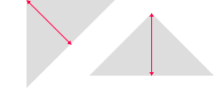

# Triangle

```css
triangle([$direction], [$size], [$color])
```

Generates a CSS right-angle isosceles triangle by passing a direction, size, and color.

```css
@param $direction
  type: string
  default: up
```
* Sets the direction for the triangle to point
* Accepts `'up-left'`, `'up'`, `'up-right'`, `'right'`, `'down-right'`, `'down'`, `'down-left'`

```css
@param $size
  type: number (unit)
  default: 1em
```
* Sets the size of the triangle's [altitude](http://en.wikipedia.org/wiki/Altitude_(triangle)) (see image below).



```css
@param $color
  type: color
  default: #777
```
* Applies a solid colour to the triangle.

---

**Example**
```css
.element
  triangle(right, 6px, #f00)

/* CSS */
.element {
  width: 0;
  height: 0;
  border-top: 6px solid transparent;
  border-bottom: 6px solid transparent;
  border-left: 6px solid #f00;
}
```

---

[Source](https://github.com/jackbrewer/stylus-mixins/blob/master/lib/stylus-mixins/triangle.styl) - [Tests](https://github.com/jackbrewer/stylus-mixins/blob/master/test/tests/triangle.styl)
